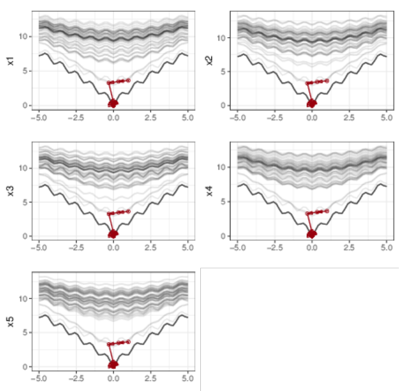
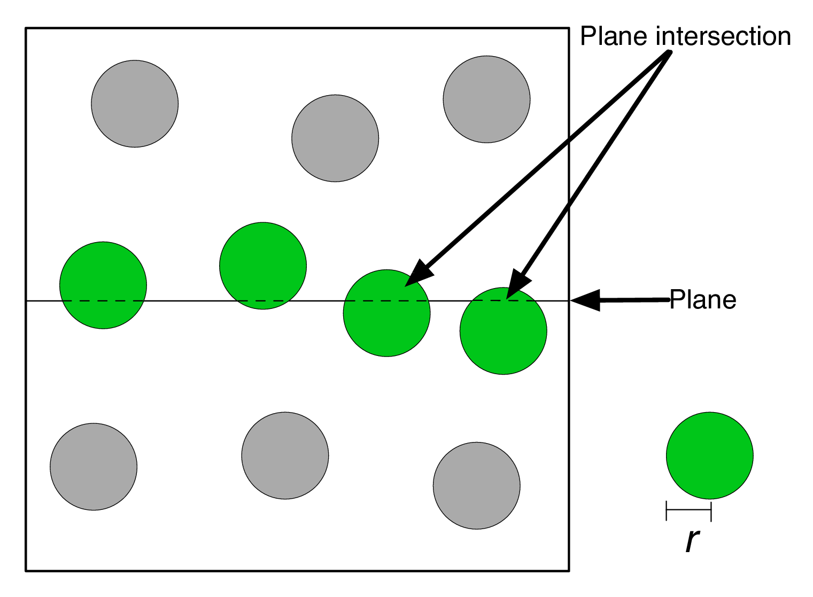

% Slicing multi-dimensional spaces
% Thomas Torsney-Weir
% VDA research group, University of Vienna

## Outline

* Motivation
* 1D slices (manifolds)
* 2D slices (shapes)
* rendering time (spheres/interactive time)
* Wrap up

# Motivation

## Multi-dimensional spaces

Simulations

## Multi-dimensional spaces

Optimization functions

## Multi-dimensional spaces

Polytopes

https://upload.wikimedia.org/wikipedia/commons/thumb/5/5c/Klein_bottle.svg/240px-Klein_bottle.svg.png

## Multi-dimensional spaces

Pareto fronts

## Challenges

Grand challenge: visualize more than 2 axes on a 2D screen

* perceptual uniformity
* familiarity
* parameters have meaning

## Why visualization?

Tasks

## What is slicing?

<aside class="notes">
Slicing comes from the medical community which is well-versed in using them
</aside>

## HyperSlice

[@Wijk:1993]

## Hyperslice

[@Wijk:1993]

## Advantages of slicing

* Distances are preserved
* Easy to understand
* Most important factors on most effective encodings

<aside class="notes">
distances and proportions are important in medical visualization

ease is in opposition to things like topology
</aside>

## Requirements of slicing

* Focus point selection (interactive)
* Speed (10fps)
* How to perform the slicing?

## What I've done

* developed the taxonomy of manifold vs shape analysis
* using 1D slices for understanding manifolds
* using 2D slices for understanding shapes
* how regular geometry can be taken advantage to create fast slicing

# 1D slices

## Motivation

Looking at manifolds

* Simulations
* Mathematical functions

## Boston housing prices

<ol>
<li>What's the most expensive house?</li>
<li>What factors contribute the most to changes in price?</li>
<li>How does home price chane with safety?</li>
<li>Is the relationship logrithmic/linear/etc?</li>
</ol>

<aside class="notes">
Motivating example
</aside>

## Building a machine learning model

<aside class="notes">
Used the UCI housing dataset, 13 factors
</aside>

## Function plots

## Multi-D example

## Boston housing example

<aside class="notes">
Each chart is one factor, the value of the factor is on the x-axis and the
function value is on the y-axis
</aside>

## Questions

<ol>
<li>What's the most expensive house?</li>
<li>What factors contribute the most to changes in price?</li>
<li>How does home price chane with safety?</li>
<li>Is the relationship logrithmic/linear/etc?</li>
</ol>

## Most expensive house

## What factors contribute to changes in price?

## Home price changes with safety

<aside class="notes">
2 ways of looking at safety
</aside>

## Is the relationship logrithmic/linear/etc?

## Model comparison

<figure>

<figcaption>Single layer NN (26 nodes)</figcaption>
</figure>
<figure>

<figcaption>SVM (polynomial kernel)</figcaption>
</figure>

<figure>

<figcaption>Dual layer NN (5 and 3 nodes)</figcaption>
</figure>
<figure>

<figcaption>SVM (RBF kernel)</figcaption>
</figure>

## Major contributions

* Introduced 1D slices
* Developed analysis tasks for examining manifolds
* Applied slices to new areas like model comparison

# 2D slices

## Motivation

Looking at shapes

* Pareto fronts
* Polytopes
* Function spaces

## Algorithm

1. Input vertices
2. Compute the convex hull ($(d-1)$-dimensional simplices)
3. Generate $m$ $d$-dimensional focus points
4. For each 2D plane, focus point, and simplex compute the intersection 
   between the plane and the $(d-1)$-dimensional simplex
5. Draw each intersection line for each focus point in a SPLOM layout

<aside class="notes">
step 4 is the important one and it's also the contribution here
</aside>

## Focus point intersection

* a 2D plane only has a well-defined normal in 3D space
* we could also define the 2D plane as a focus point with 2 free variables
  $$
  \left[ x_1, x_2, 0.23, 0.75, \ldots, 0.43 \right]^T
  $$
* How to compute where this intersects the simplex?

## Focus point intersection

Show images dealing with 2D intersection and solving for 0
(use hanna's diagrams)

## Visualization

<ul>
<li>Project all focus points down at once</li>
<li>Linked selection</li>
</ul>

movie of linked selection

## Results

* Pareto fronts
* Regular polytopes
* Function spaces

## Pareto fronts

## Regular polytopes

## Function spaces

## Major contributions

* Algorithm to produce 2D slices of polytopes
* Using projections of 2D slices instead of interactive focus point browsing
* Tasks for understanding shapes

# Fast slices (spheres)

## Interactive rendering time

<h3>3fps</h3>
movie

<h3>30fps</h3>
movie

<aside class="notes">
Question is how do we keep the rendering time fast
</aside>

## Questions

* How do we avoid slow rendering time?
* How many points?

## Slicing spheres

<h3>2D</h3>

<h3>3D</h3>

<aside class="notes">
Gaussian process model is a popular multi-D regression model
</aside>

## Algorithm

2D image

<ol>
  <li>Filter points that fall out of range of the slice</li>
  <li>Render the portion of each sphere that is sliced</li>
</ol>

## GPU implementation

<aside class="notes">
GPUs are fast, let's use them!
</aside>

## Predicting rendering time

factor table and formula

## Results

Show result charts from the paper

## Major contributions

* How to use regular geometry to make slicing fast
* Prediction algorithm and calibration method for slicing fast

# Conclusion

## Contributions

* developed the taxonomy of manifold vs shape analysis
* using 1D slices for understanding manifolds
* using 2D slices for understanding shapes
* how regular geometry can be taken advantage to create fast slicing

## Thanks!

Show images of 3 techniques

thomas.torsney-weir@univie.ac.at

