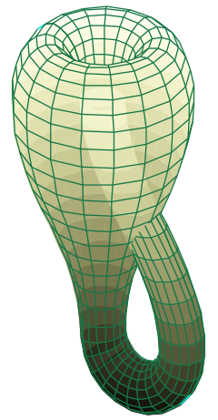
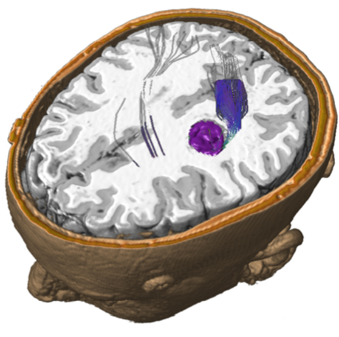
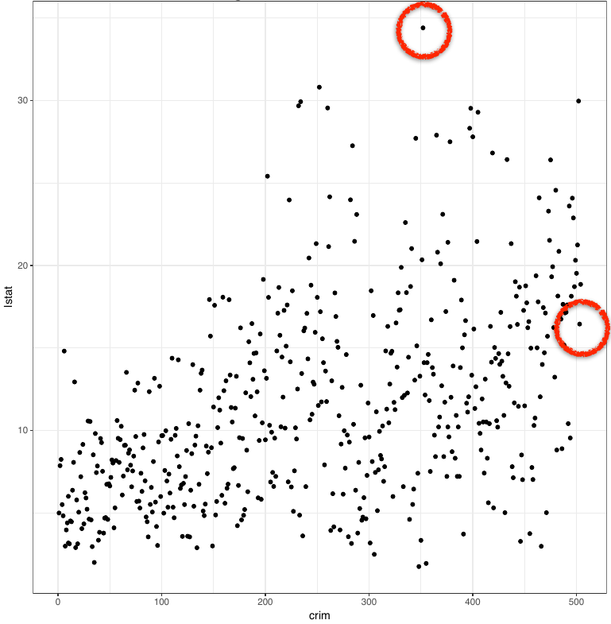
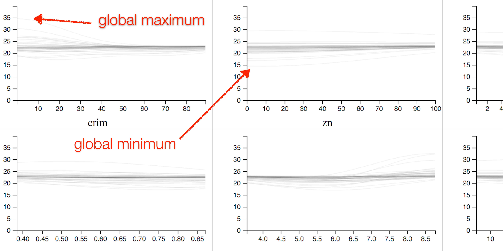
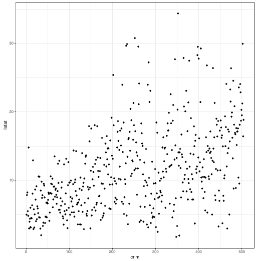

## Multi-dimensional spaces?

Simulations

<figure>
  
</figure>

Optimization functions

<figure>
  
</figure>

Polytopes

<figure>

</figure>

https://upload.wikimedia.org/wikipedia/commons/thumb/5/5c/Klein_bottle.svg/240px-Klein_bottle.svg.png

## Characteristics

* Dimensions greater than 3
* Domain and range are continuous
* Dimensions are meaningful

## Slicing

<ul>
<li>Easy to understand metaphor</li>
<li>reduces data from 3D to 2D</li>
<li>Distances are preserved</li>
<li>Most important factors on most effective encodings</li>
</ul>

<figure>
  
</figure>

<aside class="notes">

distances and proportions are important in medical visualization

ease is in opposition to things like topology
</aside>

## Slicing in 3D

<aside class="notes">
Slicing comes from the medical community which is well-versed in using them
talk about each pair of dimensions
</aside>

## Hyperslice

[@Wijk:1993]

<aside class="notes">
HyperSlice extended this to abstract objects
</aside>

## Hyperslice

$\sum_{i=0}^3 \frac{w_i}{1+ |x-p_i|^2}$

[@Wijk:1993]

## Outline of the thesis

1. Motivation
2. 1D slices: Sliceplorer [@Torsney-Weir:2017a]
3. 2D slices: HyperSliceplorer [@Torsney-Weir:2018]
4. Rendering time [@Torsney-Weir:2017]
5. Conclusion

<aside class="notes">

Here is how my thesis was organized and I also list the papers that each 
chapter is based on

</aside>

## Outline for the talk

* Continuous multi-D tasks
* Computing slices
* Projections of slices
* The future

<aside class="notes">

But for the talk, I want to highlight some of the key developments in slicing
that I developed

</aside>

# Continuous multi-D tasks

-----

Section 2.4 of the thesis

### Outline

* **Continuous multi-D tasks**
* Computing slices
* Projections of slices
* The future

## Benefits of tasks

* Give a basis for evaluation
* Allow us to identify gaps
* Help designer to create effective visualizations

## Discrete data

Many task hierarchies for discrete data

<table>
<tr>
<td>Amar, Eagan, and Stasko</td>
<td>Low-level components of analytic activity in information visualization</td>
<td>2005</td>
</tr>
<tr>
<td>Shneiderman</td>
<td>The eyes have it: A task taxonomy for information visualizations</td>
<td>1996</td>
</tr>
<tr>
<td>Brehmer and Munzner</td>
<td>A multi-level typology of abstract visualization tasks</td>
<td>2013</td>
</tr>
</table>

<aside class="notes">
There are none for continuous data! These task taxonomies focus on single 
point picking or sets of points, not a continuous transition
</aside>

## Developing the taxonomy

1. Select an existing taxonomy ([@Amar:2005])
2. Consider how each element changes with multi-dimensional data
3. Use this for comparing visualization techniques
4. Refine the taxonomy with new datasets/applications

This is just the start!

<aside class="notes">
The idea is for this taxonomy to be continuously refined as new datasets 
and domain examples emerge
</aside>

## Taxonomy

<aside class="notes">
The task "sort" didn't have a clear analog to the continuous world

Explain the table, techniques, colors, where they come from
</aside>

## Example 1: Find extremum

<h3>Discrete</h3>

  "Find data cases possessing an extreme value of an attribute over 
  its range within the data set"

<figure>
  
</figure>

<h3>Continuous</h3>

  Find local/global minima/maxima

<figure>
  
</figure>

## Find extremum

[@Gerber:2010]

## Find extremum

## Example 2: Characterize distribution

<h3>Discrete</h3>

  "Given a set of data cases and a quantitative attribute of interest, 
  characterize the distribution of that attribute's values over the set"

<figure>
  
</figure>

<h3>Continuous</h3>

  What shapes do the manifolds have?

<figure>
  
</figure>

## Characterize distribution

[@Wijk:1993]

## Characterize distribution

## Characterize distribution

## Characterize distribution

# Computing slices

-----

Sections 3.3 and 4.4 of the thesis

### Outline

* Continuous multi-D tasks
* **Computing slices**
* Projections of slices
* The future

## Dataset types

* **Functional description**
* **Simplical mesh**
* Volume

<aside class="notes">
These are the 2 ways we can be given a continuous dataset, either as a 
function with multiple parameters or as a multi-D isosurface. I haven't 
studied multi-D volumes yet but we'd extract isosurfaces anyway.

Let's look at these in turn
</aside>

## Functional description

$f(x_1, x_2, x_3, x_4, x_5) \rightarrow \textrm{scalar}$

## Doing this fast

<aside class="notes">
The idea is that if we know the functional form then we can speed up 
the rendering process.
</aside>

## Simplical mesh

# Projections of slices

-----

Sections 2.3.3 and 3.3 of the thesis

### Outline

* Continuous multi-D tasks
* Computing slices
* **Projections of slices**
* The future

## How to choose the focus point?

Let the user interact

embed movie

<aside class="notes">
The problem is that this is a local view and the user can get easily lost!
</aside>

## Focus point sampling

## Interactive viewers

* Linked highlighting
* Individual slice selection
* Manually adding additional slices

## Linked highlighting

Movies/pictures here

## Individual slice selection

Video?
Local view of hypersliceplorer here

## Adding additional slices

Video?
Some sort of photo here too...

# The future

-----

Sections 5.1 and 5.2 of the thesis

### Outline

* Continuous multi-D tasks
* Computing slices
* Projections of slices
* **The future**

## Where do we go from here?

* Dissemination of results
* ???

# Conclusion

-----

## Outline for the talk

* Multi-D spaces and slices
* Continuous multi-D tasks
* Computing slices
* Projections of slices
* The future

## Thank you!

  

<ul>
  <li>Torsten Möller</li>
  <li>Michael Sedlmair</li>
  <li>VDA group</li>
  <li>Admin staff</li>
  <li>Friends and family</li>
  <li>Doggies!</li>
</ul>
  

  

<figure>
  
</figure>
  

